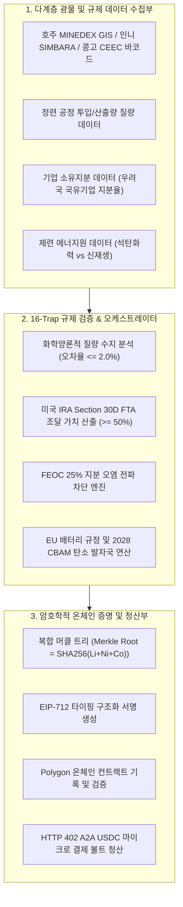

# [특허 임시명세서] 자율 인공지능 에이전트 기반 배터리 핵심 광물 공급망 컴플라이언스 검증 및 머클트리 EIP-712 온체인 여권 발행 장치 및 그 방법

---

## 【서지 사항】
* **발명의 명칭(국문)**: 자율 인공지능 에이전트 기반 배터리 핵심 광물 공급망 컴플라이언스 검증 및 머클트리 EIP-712 온체인 여권 발행 장치 및 그 방법
* **발명의 명칭(영문)**: Apparatus and Method for Verifying Battery Critical Minerals Supply Chain Compliance and Issuing Merkle Tree EIP-712 On-Chain Passports Based on Autonomous AI Agents
* **출원 구분**: 특허출원 (특허법 제42조의2에 따른 임시명세서 출원)
* **기술 분류 (IPC/CPC)**: G06Q 10/08 (물류 및 공급망 관리), G06Q 20/38 (결제/보안 프로토콜), H04L 9/32 (암호학적 증명/블록체인), G06F 16/27 (분산 데이터베이스/오라클)

---

## 【기술분야】
본 발명은 전기차(EV) 및 에너지 저장장치(BESS)용 이차전지 배터리 공급망 관리에 관한 것으로, 보다 상세하게는 리튬(Li), 니켈(Ni), 코발트(Co), 구리(Cu), 은(Ag) 등 배터리 핵심 광물의 채굴, 제련, 정련, 물류 및 양극재 합성 전 과정에 걸쳐 글로벌 규제(미국 인플레이션 감축법(IRA), 해외우려기관(FEOC) 통제, 유럽연합 배터리 규정(EU 2023/1542) 및 탄소국경조정제도(CBAM))를 실시간 자율 에이전트(Autonomous AI Agent)를 통해 인적 개입 없이(Zero-Human-in-the-Loop) 자동 검증하고, 공급망 기업의 원가 및 거래선 영업비밀을 보호하면서도 위·변조가 불가능한 머클 트리(Merkle Tree) 루트 및 EIP-712 기반 암호학적 온체인(On-Chain) 배터리 여권을 발행하는 장치 및 그 방법에 관한 것이다.

---

## 【발명의 배경이 되는 기술】
1. **글로벌 배터리 공급망 규제의 급변 및 복합화**
   * 최근 미국 인플레이션 감축법(IRA Section 30D)은 배터리 핵심 광물 조달 가치의 일정 비율(50% 이상)을 미국 또는 미국과 자유무역협정(FTA)을 체결한 국가에서 조달할 것을 요구하고 있으며, 특히 중국, 러시아, 북한, 이란 등 해외우려기관(FEOC: Foreign Entity of Concern)에 25% 이상의 지분 또는 실질적 통제권을 가진 기업이 생산/가공한 광물이 단 1개라도 포함될 경우 배터리 팩 전체에 대한 세액공제($3,750)를 즉시 전면 박탈하는 엄격한 배제 조항을 적용하고 있다.
   * 또한, 유럽연합(EU)은 2026~2027년부터 배터리 여권(Battery Passport, EU 2023/1542)을 의무화하고, 제조 및 제련 과정에서 발생하는 Scope 1~3 탄소 발자국과 인도네시아 고압산침출(HPAL) 제련소 등의 석탄 자가화력발전 사용에 따른 탄소국경조정제도(CBAM) 할증 페널티를 부과하고 있다.

2. **종래 기술의 한계점 및 문제점**
   * **수작업 및 문서 위변조 취약성**: 종래의 원산지 증명 및 통관 프로세스는 수출입 기업이 작성한 종이 서류나 PDF 원산지증명서(C/O), 선하증권(B/L)에 의존하고 있어, 제3국(예: 베트남, 말레이시아 등)을 경유하는 단순 환적(Transshipment)을 통한 '원산지 세탁(Mineral Laundering)'이나 위조 인증서 제출을 선제적으로 감지하지 못함.
   * **영업비밀 노출 딜레마**: 완성차(OEM) 및 배터리 셀 제조사가 규제 당국과 감사 기구에 광물 조달 내역을 소명하는 과정에서 공급 단가, 정련 수율, 원료 배합비 등 핵심 영업비밀이 외부에 노출되는 보안상 한계가 존재함.
   * **파편화된 이종 광물 데이터의 통합 한계**: 배터리 양극재(NCM 811, 622 등)는 호주산 리튬, 인도네시아산 니켈, 콩고산 코발트 등 물리적/지리적 성격과 관할 정부의 법규(인니 SIMBARA 세금, 콩고 CEEC 바코드 봉인 등)가 완전히 상이하여, 이를 하나의 완성 배터리 셀/팩 단위로 통합 연산하고 온체인에서 실시간 검증하는 오라클 아키텍처가 전무한 실정임.

---

## 【해결하려는 과제】
본 발명은 상기와 같은 종래의 문제점을 해결하기 위하여 안출된 것으로, 다음과 같은 기술적 과제를 해결하고자 한다:
1. 전 세계 광산 및 제련소의 공간 지리정보(GIS)와 화학양론적 전환 수율(Stoichiometric Yield)을 실시간 대조하여 제3국 경유 원산지 세탁 및 불법 광물 혼입을 100% 기계적으로 원천 차단하는 검증 엔진을 제공함.
2. NCM 양극재 내 이종 광물(Li, Ni, Co)의 혼합 비율과 시세를 기반으로 미국 IRA FTA 적격 가치를 정밀 산출하고, 어느 한 광물이라도 FEOC 지분율(25% 이상)을 위반할 경우 전체 배터리 팩으로 오염을 전파(Taint Propagation)하여 실격 처리하는 알고리즘을 구현함.
3. 제련소 전력원(자가 석탄화력 vs 신재생에너지)을 식별하여 EU 배터리 규정 및 CBAM Scope 1~3 탄소 페널티를 자동으로 연산함.
4. 기업의 핵심 원가 및 거래처 정보를 블라인딩(오프체인 보관)하면서도, 검증 결과만을 암호학적 머클 트리 루트로 결합하여 EIP-712 표준 타이핑 서명으로 폴리곤 등 블록체인 상에 가스비 효율적으로 영구 증명하는 스마트 오라클 장치를 제공함.
5. 인간의 신용카드나 은행 송금 대신, AI 자율 에이전트가 HTTP 402 프로토콜과 USDC 마이크로 결제를 통해 기계 대 기계(M2M)로 수수료를 실시간 정산하는 경제 엔진을 제공함.

---

## 【과제의 해결 수단】
상기 과제를 달성하기 위한 본 발명의 일 양상에 따른 자율 AI 에이전트 기반 배터리 핵심 광물 컴플라이언스 검증 및 온체인 여권 발행 시스템은,
* **다계층 원산지 데이터 수집부**: 글로벌 광산/제련소의 공간 좌표(GIS), 원광석 추출량, 공정 투입량, 선적 문서(e-B/L), 국가별 세무 영수증(인니 SIMBARA NTPN, 콩고 CEEC 봉인 코드 등) 및 기업 지분 구조 데이터를 외부 소스로부터 기계적으로 수집하는 모듈;
* **화학양론적 질량 수지(Mass Balance) 및 세탁 탐지부**: 상기 수집된 원광석 질량과 정련 화합물(수산화리튬, MHP, 수산화코발트 등) 간의 이론적 화학양론 전환 수율 대비 실제 산출량의 질량 오차율을 산출하고, 허용 임계값(±2.0%) 초과 시 광물 세탁 플래그를 생성하는 모듈;
* **IRA 가치 및 FEOC 오염 전파 연산부**: 복합 양극재의 화학 조성비(NCM 811, 622, 523) 및 광물 시세를 매칭하여 전체 조달 가치 중 미국 FTA 체결국 채굴/가공 가치 비율(≥50%)을 산출하고, 투입 광물 중 어느 하나라도 FEOC(해외우려기관) 기준(지분율 25% 이상)에 해당할 경우 전체 배터리 팩 식별자에 FEOC 오염 플래그(`FLAG_COMPOSITE_FEOC_TAINT`)를 전파하여 불합격 판정하는 모듈;
* **탄소 발자국 및 CBAM 페널티 연산부**: 각 광물의 정련 에너지원(자가 석탄화력 발전 여부)을 판별하여 EU 배터리 규정 2023/1542 기준 탄소 발자국(Scope 1-3) 및 2028 CBAM 할증 페널티를 연산하는 모듈;
* **머클 트리 및 EIP-712 온체인 여권 발행부**: 각 개별 광물 검증 데이터셋의 해시값을 머클 리프(Leaf)로 설정하여 복합 머클 루트(Composite Merkle Root)를 생성하고, 인가된 오라클의 프라이빗 키로 EIP-712 표준에 부합하는 타입화된 데이터 서명을 생성하여 블록체인 네트워크에 기록하는 모듈; 및
* **HTTP 402 기반 A2A 마이크로 결제 청산부**: AI 에이전트의 컴플라이언스 질의 시 HTTP 402(Payment Required) 응답을 반환하고, 블록체인 볼트로부터 지정된 암호화폐(USDC) 마이크로 결제를 검증한 후 검증 리포트 및 서명을 즉시 발급하는 청산 모듈;
을 포함한다.

---

## 【발명의 효과】
본 발명에 따르면 다음과 같은 현저한 효과를 발휘한다:
1. **인적 오류 및 위변조 원천 차단**: 100% 기계 대 기계(M2M) 검증을 수행함으로써 위조 PDF나 서류 조작을 통한 광물 세탁을 완벽히 방지함.
2. **미국/EU 규제 리스크 제로화**: 배터리 셀/팩 제조사가 출하 전 단계에서 IRA 50% FTA 요건 및 FEOC 25% 오염 여부, EU CBAM 탄소 페널티를 실시간으로 시뮬레이션하고 검증할 수 있어 천문학적인 세액공제 환수나 통관 압류 리스크를 사전에 소멸시킴.
3. **영업비밀 완벽 보호와 온체인 신뢰성의 양립**: 상세 원가나 거래처 정보는 오프체인에 암호화하여 보관하고, 대외적으로는 머클 루트와 EIP-712 서명만을 온체인에 기록하므로 영업비밀 유출 없이도 규제 당국에 완벽한 무결성을 입증함.
4. **글로벌 선도 표준 선점**: 차세대 전기차 배터리 여권 시장에서 자율 AI 에이전트와 블록체인 오라클이 결합된 독점적이고 독창적인 기술적 장벽을 확보함.

---

## 【도면의 간단한 설명】
* **도 1**: 본 발명의 일 실시예에 따른 배터리 핵심 광물 오라클의 전체 시스템 아키텍처 다이어그램.
* **도 2**: 화학양론적 질량 수지 및 제3국 단순 환적 세탁 방지 검증 프로세스 흐름도.
* **도 3**: 복합 양극재(NCM) 대상 미국 IRA FTA 가치 산출 및 FEOC 25% 오염 전파 알고리즘 순서도.
* **도 4**: 개별 광물 리프 해시로부터 복합 머클 루트를 생성하고 EIP-712 타이핑 온체인 증명을 발행하는 암호화 매커니즘 도면.
* **도 5**: HTTP 402 기반 AI 에이전트 간(A2A) 실시간 온체인 마이크로 결제 및 청산 시퀀스 다이어그램.

---

## 【발명을 실시하기 위한 구체적인 내용】

### 1. 전체 시스템 아키텍처 (도 1 참조)
본 발명의 시스템은 광산, 제련소, 물류 선박, 글로벌 규제 데이터베이스로부터 데이터를 수집하는 **데이터 계층**, 16단계 규제 트랩(Trap)을 검증하는 **컴플라이언스 엔진 계층**, 복합 배터리 팩 여권을 합성하는 **오케스트레이터 계층**, 및 분산원장에 영구 기록하는 **블록체인 증명 계층**으로 구성된다.

### 2. 화학양론적 질량 수지 및 세탁 방지 로직 (도 2 참조)
본 발명은 각 광물이 원광석에서 배터리급 화합물로 제련될 때 원소의 몰질량(Molar Mass)에 기반한 엄밀한 이론적 질량 수율을 적용한다:
1. **리튬(Lithium)**: 스포듀민(Spodumene 6% Li₂O)에서 배터리급 수산화리튬(LiOH·H₂O)으로의 이론적 전환비율은 약 **7.5 : 1** 이다.
2. **니켈(Nickel)**: 인니 리모나이트(Limonite ~1.3% Ni)에서 MHP(Mixed Hydroxide Precipitate ~40% Ni)로의 전환비율은 약 **31.34 : 1** 이다.
3. **코발트(Cobalt)**: 콩고 헤테로제나이트(Heterogenite ~8.0% Co)에서 배터리급 수산화코발트(Co(OH)₂ ~60% Co)로의 전환비율은 약 **23.53 : 1** 이다.

시스템은 실제 공장 데이터 $\text{Mass}_{\text{actual}}$과 이론적 전환량 $\text{Mass}_{\text{theoretical}}$ 간의 불일치율(Discrepancy)을 아래 수학식 1로 계산한다:

$$\text{Discrepancy (\%)} = \left| \frac{\text{Mass}_{\text{actual}} - \text{Mass}_{\text{theoretical}}}{\text{Mass}_{\text{theoretical}}} \right| \times 100\%$$

상기 불일치율이 임계값(2.0%)을 초과할 경우, 시스템은 외부 미신고 불법 광물이나 서류상 세탁된 제3국 광물이 혼입된 것으로 판정하고 즉시 `FLAG_MASS_BALANCE_MISMATCH` 및 검증 탈락을 발생시킨다.

### 3. 미국 IRA FTA 가치 산출 및 FEOC 지분 오염 전파 (도 3 참조)
복합 양극재(예: NCM 811)에서 각 광물의 가치 비중과 FTA 적격성을 다음과 같이 산출한다:
* **총 조달 가치 산출**:
  $$\text{Value}_{\text{Total}} = (\text{Mass}_{\text{Li}} \times P_{\text{Li}}) + (\text{Mass}_{\text{Ni}} \times P_{\text{Ni}}) + (\text{Mass}_{\text{Co}} \times P_{\text{Co}})$$
  (여기서 $P$는 실시간 벤치마크 시장 가격)
* **FTA 적격 가치 비율 판정**:
  $$\text{FTA Ratio (\%)} = \frac{\sum \text{Value}_{\text{FTA-Compliant}}}{\text{Value}_{\text{Total}}} \times 100\% \ge 50.0\%$$
* **FEOC 25% 오염 전파 알고리즘**:
  투입된 $N$개의 광물 중 어느 하나라도 해외우려기관(중국 국유기업 등)의 직·간접 지분율 $S_i \ge 25.0\%$ 이거나 이사회 의결권 등 실질 통제권을 보유한 경우, 시스템은 전파 연산자 $\Omega$를 적용하여 전체 배터리 팩 상태를 다음과 같이 강제 전이한다:
  
$$\Omega(\text{Pack}) = \begin{cases} \text{PASSED}, & \text{if } \forall i, S_i < 25.0\% \text{ and } \text{FTA Ratio} \ge 50.0\% \\ \text{FLAG\_COMPOSITE\_FEOC\_TAINT (FAILED)}, & \text{if } \exists i \text{ s.t. } S_i \ge 25.0\% \end{cases}$$

이로써 개별 광물 검증에 그치지 않고, 복합 배터리 팩 전체에 대한 세액공제 적격성을 단 한 번의 연산으로 엄정 판정한다.

### 4. 머클 트리(Merkle Tree) 및 EIP-712 온체인 암호학적 증명 구조 (도 4 참조)
* **머클 리프 해시(Leaf Hashes)**:
  $$\text{Leaf}_{\text{Li}} = \text{SHA256}(\text{LotId}_{\text{Li}} \,\|\, \text{GIS}_{\text{Li}} \,\|\, \text{FTA}_{\text{Li}} \,\|\, \text{FEOC}_{\text{Li}})$$
  $$\text{Leaf}_{\text{Ni}} = \text{SHA256}(\text{LotId}_{\text{Ni}} \,\|\, \text{GIS}_{\text{Ni}} \,\|\, \text{FTA}_{\text{Ni}} \,\|\, \text{FEOC}_{\text{Ni}})$$
  $$\text{Leaf}_{\text{Co}} = \text{SHA256}(\text{LotId}_{\text{Co}} \,\|\, \text{GIS}_{\text{Co}} \,\|\, \text{FTA}_{\text{Co}} \,\|\, \text{FEOC}_{\text{Co}})$$
* **복합 머클 루트(Composite Merkle Root)**:
  $$\text{Merkle Root} = \text{0x} + \text{SHA256}(\text{Leaf}_{\text{Li}} \,\|\, \text{Leaf}_{\text{Ni}} \,\|\, \text{Leaf}_{\text{Co}})$$
* **EIP-712 구조체**:
  배터리 팩 식별자(`battery_pack_id`), 화학조성(`chemistry`), 복합 머클 루트(`merkle_root`), IRA 적격 여부(`ira_compliant`), 종합 적격 스코어(`composite_score`)를 포함하는 타입화된 도메인 데이터에 대해 오라클 개인키로 ECDSA 타원곡선 서명($v, r, s$)을 생성하여 컨트랙트에 전달한다.

---

## 【특허청구범위】

### 【청구항 1】 (독립항)
컴퓨터 프로세서에 의해 실행되는 배터리 핵심 광물 공급망 컴플라이언스 검증 장치에 있어서,
배터리 셀 또는 팩에 투입되는 복수의 핵심 광물(리튬, 니켈, 코발트 중 적어도 둘 이상)에 대하여 채굴지 공간 좌표(GIS), 정련 공정 투입/산출 질량 데이터, 제련소 에너지원 정보, 및 공급망 참여 기업의 해외우려기관(FEOC) 지분율 데이터를 수집하는 다계층 데이터 수집부;
상기 수집된 질량 데이터를 기 설정된 원소별 화학양론적 전환 수율(Stoichiometric Yield)과 대조하여 오차율을 산출하고, 상기 오차율이 임계값을 초과하는 경우 비인가 광물 혼입 세탁 플래그를 생성하는 화학양론적 질량 수지 검증부;
상기 복수 광물의 시장 기준 가격 및 조달 원산지에 기초하여 미국 인플레이션 감축법(IRA)에 따른 자유무역협정(FTA) 체결국 조달 가치 비율을 연산하고, 상기 복수의 광물 중 어느 하나라도 상기 해외우려기관 지분율이 기 설정된 배제 기준값 이상인 경우 전체 배터리 셀 또는 팩에 대해 FEOC 오염 플래그를 전파하여 부적격 처리하는 복합 컴플라이언스 연산부; 및
상기 복수 광물 각각의 검증 결과 데이터를 해싱한 복수의 머클 리프 해시(Merkle Leaf Hash)로부터 복합 머클 루트(Composite Merkle Root)를 생성하고, 상기 복합 머클 루트를 포함하는 데이터 구조체에 대해 인가된 오라클의 개인키로 EIP-712 형식의 온체인 전자서명을 생성하는 암호학적 여권 증명부;
를 포함하는 자율 에이전트 기반 배터리 핵심 광물 컴플라이언스 검증 및 여권 발행 장치.

### 【청구항 2】 (종속항)
제1항에 있어서,
상기 화학양론적 질량 수지 검증부는,
스포듀민 원광석 대비 수산화리튬(LiOH)의 전환 비율을 7.5:1로 적용하고, 리모나이트 원광석 대비 혼합수산화침전물(MHP)의 전환 비율을 31.34:1로 적용하며, 헤테로제나이트 원광석 대비 수산화코발트의 전환 비율을 23.53:1로 적용하여 이론적 산출량을 계산하고,
실제 산출량과의 불일치 오차율이 2.0%를 초과하는 경우 단순 환적 또는 불법 원광석 혼입으로 판정하는 것을 특징으로 하는 장치.

### 【청구항 3】 (종속항)
제1항에 있어서,
상기 복합 컴플라이언스 연산부는,
양극재 화학 조성(NCM 811, NCM 622, NCM 523)에 따라 투입 광물 질량에 단위당 시장 가격을 곱하여 총 조달 가치를 산출하고, 상기 총 조달 가치 대비 미국 FTA 체결국 채굴/가공 가치 비율이 50% 이상인지 여부를 판정하며,
상기 복수 광물 중 단 하나의 광물이라도 해외우려기관(중국, 러시아, 북한, 이란) 소유 지분율이 25% 이상인 경우, 상기 FTA 조달 가치 비율의 충족 여부와 무관하게 전체 배터리 팩을 세액공제 불합격 상태로 판정하는 오염 전파 알고리즘을 실행하는 것을 특징으로 하는 장치.

### 【청구항 4】 (종속항)
제1항에 있어서,
상기 제련소의 전력원을 식별하여 인도네시아 고압산침출(HPAL) 공정의 자가 석탄화력발전 사용 여부를 판별하고, 석탄화력 사용 확인 시 유럽연합 배터리 규정 2023/1542 및 탄소국경조정제도(CBAM)에 따른 할증 탄소 배출 페널티(+26.5 kg CO₂e/kWh)를 자동 부과하는 탄소 규제 연산부를 더 포함하는 장치.

### 【청구항 5】 (종속항)
제1항에 있어서,
상기 암호학적 여권 증명부는,
공급망 기업의 거래 단가, 영업이익률, 공급자 명칭을 포함하는 영업비밀 데이터를 오프체인에 분리 보관하고,
블록체인 분산원장에는 상기 복합 머클 루트, 배터리 팩 식별자, 배터리 화학 조성, 컴플라이언스 종합 스코어, 및 상기 EIP-712 전자서명만을 기록하여 검증 가능하도록 구성되는 것을 특징으로 하는 장치.

### 【청구항 6】 (종속항)
제1항에 있어서,
외부 인공지능 에이전트의 검증 요청 수신 시 HTTP 402(Payment Required) 상태 코드를 응답하고, 블록체인 네트워크 상의 지불 볼트(Vault)로부터 사전 설정된 암호화폐(USDC) 마이크로 결제의 트랜잭션 영수증을 검증한 후에 상기 검증 결과 및 전자서명을 상기 외부 에이전트에 반환하는 기계 대 기계(M2M) 마이크로 결제 청산부를 더 포함하는 장치.

### 【청구항 7】 (방법 독립항)
컴퓨터에 의해 수행되는 배터리 핵심 광물 공급망 컴플라이언스 검증 및 온체인 여권 발행 방법에 있어서,
(a) 프로세서가 배터리에 투입되는 복수의 핵심 광물에 대한 채굴지 공간 좌표, 공정 투입/산출 질량, 제련소 에너지원, 및 기업 지분율 데이터를 수집하는 단계;
(b) 프로세서가 상기 수집된 질량 데이터를 화학양론적 기준 전환 수율과 비교하여 오차율이 임계값을 초과하는지 여부를 검증하여 광물 세탁 여부를 판정하는 단계;
(c) 프로세서가 양극재 조성비 및 광물 시세에 기초하여 미국 IRA FTA 적격 조달 가치 비율을 연산하고, 광물 중 어느 하나라도 해외우려기관(FEOC) 지분율이 기준값을 초과하는 경우 전체 배터리 팩으로 오염 플래그를 전파하는 단계;
(d) 프로세서가 각 광물의 검증 해시값으로부터 복합 머클 루트(Composite Merkle Root)를 생성하는 단계; 및
(e) 프로세서가 인가된 오라클의 개인키로 상기 복합 머클 루트를 포함하는 데이터에 대한 EIP-712 규격 전자서명을 생성하여 블록체인에 영구 기록하는 단계;
를 포함하는 컴플라이언스 검증 및 온체인 여권 발행 방법.

---

## 【요약서】
본 발명은 자율 AI 에이전트 기반 배터리 핵심 광물 공급망 컴플라이언스 검증 및 머클트리 EIP-712 온체인 여권 발행 장치 및 그 방법에 관한 것이다. 본 발명은 채굴지 공간좌표 및 공정 질량 데이터를 화학양론적 이론 수율(스포듀민 7.5:1, 리모나이트 31.34:1, 헤테로제나이트 23.53:1)과 대조하여 광물 세탁을 원천 탐지하고, 복합 양극재(NCM)의 미국 IRA 50% FTA 조달 가치 산출 및 해외우려기관(FEOC) 25% 지분 오염 전파 알고리즘을 적용하며, 복합 머클 루트 및 EIP-712 타이핑 전자서명을 통해 기업 영업비밀을 보호하면서도 위변조가 불가능한 온체인 배터리 여권을 무인 자율 발행한다. 또한 HTTP 402 기반의 M2M USDC 마이크로 결제 청산 메커니즘을 통합하여 차세대 배터리 공급망 규제 대응을 완전 자동화한다.
