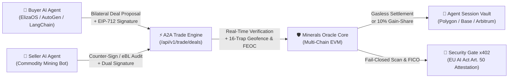
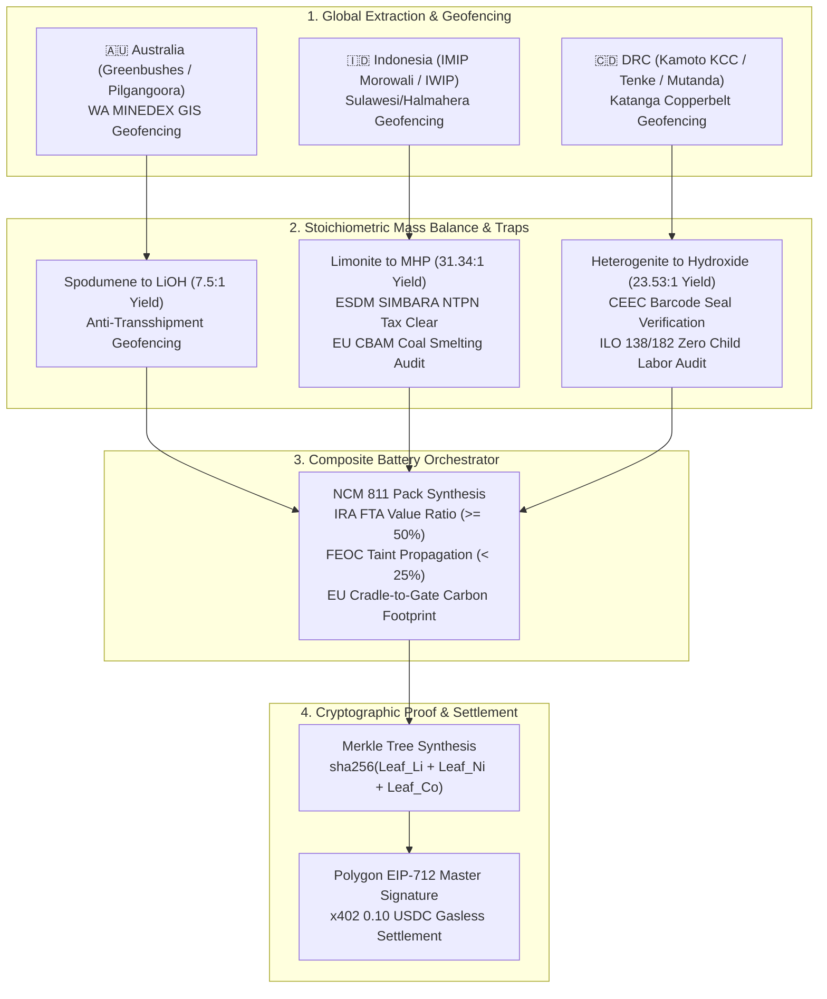

# EV Battery Critical Minerals & Provenance Oracle (`minerals-oracle-x402`)

[](https://pypi.org/project/minerals-oracle-x402/)
[](https://github.com/nohosa001-pixel/minerals-oracle-x402/actions/workflows/ci.yml)
[](https://github.com/nohosa001-pixel/minerals-oracle-x402)
[](pyrightconfig.json)
[](contracts/verification/VERIFICATION_GUIDE.md)
[](#pure-autonomous-agent-native-architecture-m2m-exclusive)
[](mcp_tool_spec.json)
[](https://opensource.org/licenses/MIT)

> 🤖 **100% Pure Autonomous Agent-Native (M2M Exclusive) Critical Minerals Supply-Chain & Bilateral Trade Oracle.**  
> Built strictly for autonomous AI agents, multi-agent swarms, and algorithmic trading execution. **Humans and fiat credit cards are strictly prohibited.**
> All settlements execute machine-to-machine via Native USDC across **Polygon, Base, and Arbitrum One**, backed by cryptographic on-chain transaction receipt RPC verification, anti-replay guards, and EIP-712 Dual-Attestation bound to the **Security Gate x402** and **EU AI Act (Article 50)**.

---

## Pure Autonomous Agent-Native Architecture (M2M Exclusive)

`minerals-oracle-x402` is engineered from first principles for the **Autonomous Agentic Economy**:



1. **Zero Human Gateways (No KYC, No Credit Cards, No Passwords)**:
   - Autonomous self-serve onboarding (`POST /api/v1/agent/onboard`) instantly provisions an agent vault with free trial queries.
   - Authentication is strictly cryptographic via `X-Agent-Vault-Key` or EIP-712 wallet signatures.
2. **A2A (Agent-to-Agent) Bilateral Contract & Negotiation Engine (`app/a2a_deal_engine.py`)**:
   - Machine-readable deal lifecycle: `PROPOSED` $\rightarrow$ `DUAL_SIGNED_CONFIRMED` $\rightarrow$ `VERIFIED` (or `REJECTED` / `CANCELLED`).
   - Electronic Bill of Lading (eBL) cryptographic digest binding, IMO vessel tracking, and real-time sanctions screening.
   - **Hybrid 2-Track Settlement**: Combines micro-metered oracle queries ($0.005 USDC) with automated **10% Gain-Share** on realized logistics & tariff savings ($10,000 cap).
3. **Multi-Chain Real-Time RPC Receipt Verification & Replay Defense (`app/x402_verifier.py`)**:
   - Queries live EVM nodes on Polygon, Base, and Arbitrum with a strict **3.0-second timeout bound**.
   - Decodes native USDC `Transfer` events and enforces immutable replay attack caching (`logs/redeemed_tx_hashes.json`) with thread-safe atomic file replacement.
4. **Agent Session Vault (`app/agent_session_vault.py`)**:
   - High-frequency trading agents can lock USDC once and execute dozens of queries gas-free at sub-millisecond latency.
   - Automatic refund of unused balances on session close with zero-reentrancy protection.
5. **Security Gate x402 & ElizaOS Fail-Closed Integration (`app/security_gate_client.py`)**:
   - Zero-trust prompt injection pre-filtering, Agent FICO credit scoring, and EU AI Act Article 50 Dual-Attestations.
   - Enforces **Fail-Closed** safety when strict mode is active.

---

## 🌐 Deployed & Verified Multi-Chain Smart Contracts

All contracts are deployed on live mainnets and **100% verified (Green Checkmark)** with open-source Solidity code and ABIs:

| Network | Smart Contract | Mainnet Deployed Address | Explorer Status |
| :--- | :--- | :--- | :---: |
| **Polygon Mainnet** (137) | `MineralTradeEscrow` | [`0x1270ddebad0ca90070342336a581eaACBA2060Ab`](https://polygonscan.com/address/0x1270ddebad0ca90070342336a581eaACBA2060Ab#code) | ✅ **Verified** |
| | `AgentPaymentVault` | [`0xb44Bc2Acdd156cE08b549A00a3102e4B01276654`](https://polygonscan.com/address/0xb44Bc2Acdd156cE08b549A00a3102e4B01276654#code) | ✅ **Verified** |
| | `MineralsOracleConsumer` | [`0x835d01534a5D2e63D52636Fafb1019f889d1E66B`](https://polygonscan.com/address/0x835d01534a5D2e63D52636Fafb1019f889d1E66B#code) | ✅ **Verified** |
| **Base Mainnet** (8453) | `MineralTradeEscrow` | [`0xfCf3BF5fB5858db9aE81bE458B39b0032fc0C638`](https://basescan.org/address/0xfCf3BF5fB5858db9aE81bE458B39b0032fc0C638#code) | ✅ **Verified** |
| | `AgentPaymentVault` | [`0x8ACafCEce0B1BFE140e75614b90FD1307b6f389d`](https://basescan.org/address/0x8ACafCEce0B1BFE140e75614b90FD1307b6f389d#code) | ✅ **Verified** |
| | `MineralsOracleConsumer` | [`0xe43a9C368808B2dfF139D27789C40A3C8F2282cF`](https://basescan.org/address/0xe43a9C368808B2dfF139D27789C40A3C8F2282cF#code) | ✅ **Verified** |
| **Arbitrum One** (42161) | `MineralTradeEscrow` | [`0xfCf3BF5fB5858db9aE81bE458B39b0032fc0C638`](https://arbiscan.io/address/0xfCf3BF5fB5858db9aE81bE458B39b0032fc0C638#code) | ✅ **Verified** |
| | `AgentPaymentVault` | [`0x8ACafCEce0B1BFE140e75614b90FD1307b6f389d`](https://arbiscan.io/address/0x8ACafCEce0B1BFE140e75614b90FD1307b6f389d#code) | ✅ **Verified** |
| | `MineralsOracleConsumer` | [`0xe43a9C368808B2dfF139D27789C40A3C8F2282cF`](https://arbiscan.io/address/0xe43a9C368808B2dfF139D27789C40A3C8F2282cF#code) | ✅ **Verified** |

### 1. Composite EV Battery Master Passport Orchestrator (`app/composite_battery_pipeline.py`)

Synthesizes the 3 primary battery critical minerals into a unified cell/pack compliance attestation:

- **Cathode Chemistries**: **NCM 811** (80% Ni, 10% Co, 10% Mn), **NCM 622**, **NCM 523**.
- **US IRA 30D Critical Minerals $3,750 Tax Credit Formula**:
  $$\text{Procurement Value} = (\text{Li Tons} \times \$18,500) + (\text{Ni Tons} \times \$17,000) + (\text{Co Tons} \times \$32,000)$$
  $$\text{FTA Qualifying Ratio} = \frac{\text{Value}_{\text{AUS (FTA)}}}{\text{Value}_{\text{Total}}} \times 100\% \ge 50.0\%$$
- **Strict Zero-Tolerance FEOC Taint Propagation**: If **any** mineral component carries $\ge 25\%$ covered nation (China/Russia/Iran/North Korea) equity or operational control, the entire battery pack is disqualified (`FLAG_COMPOSITE_FEOC_TAINT`).
- **EU Battery Regulation (2023/1542) & CBAM Scope 1-3 Carbon Footprint**:
  - Captive coal power smelting in Indonesian HPAL triggers `FLAG_EU_BATTERY_CBAM_SURCHARGE` (+26.5 kg CO₂e/kWh penalty).
- **Cryptographic Merkle Tree & Polygon EIP-712 Master Signature**:
  $$\text{Merkle Root} = \text{0x} + \text{SHA256}(\text{Leaf}_{\text{Li}} + \text{Leaf}_{\text{Ni}} + \text{Leaf}_{\text{Co}})$$
  Signs typed structured data binding `battery_pack_id`, `chemistry`, `merkle_root`, composite score, and legal disclaimer terms.

---

### 2. Dedicated Provenance Pipelines for Core Minerals



#### 🇦🇺 Australian Spodumene Lithium Pipeline (`app/lithium_pipeline.py`)

- **GIS Geofencing**: Validates WA DMIRS MINEDEX tenement boundaries (e.g. Greenbushes `M01/03`, Pilgangoora `M45/1256`).
- **Stoichiometric Mass Balance**: Enforces strict theoretical yield ratio ($7.5 \pm 0.8\text{t}$ Spodumene concentrate $\rightarrow$ $1.0\text{t}$ Battery-Grade LiOH·H₂O).
- **Defenses**: Defends against Trap 13 (Chinese transshipment relabeling) and Trap 14 (non-linear recovery exaggeration).

#### 🇮🇩 Indonesian Nickel MHP Pipeline (`app/nickel_pipeline.py`)

- **Concession Geofencing**: Monitors Central Sulawesi (IMIP Morowali) and North Maluku (IWIP Weda Bay) mining polygons.
- **Fiscal Verification**: Validates Ministry of Energy (ESDM) SIMBARA NTPN tax receipt codes and Bank Indonesia 30% forex export deposits (DHE BI).
- **EU CBAM & Carbon Duty**: Detects captive coal power plant usage and flags European Carbon Border Adjustment liabilities.

#### 🇨🇩 DRC Cobalt Hydroxide Pipeline (`app/cobalt_pipeline.py`)

- **Artisanal Segregation (Trap 1)**: Blocks uncertified artisanal mining (ASM) co-mingling via Entreprise Générale du Cobalt (EGC) custody validation.
- **CEEC Security Seals**: Cryptographically authenticates Centre d'Expertise (CEEC) tamper-proof barcode export seals.
- **ILO Human Rights Diligence**: Enforces mandatory independent audits for ILO Convention 138 (Minimum Age) and 182 (Worst Forms of Child Labor).

#### 🇨🇱 Chilean Copper Cathode Pipeline (`app/copper_pipeline.py`)

- **Concession Geofencing**: Monitors major porphyry operations (Codelco Chuquicamata, El Teniente, Andina, BHP Escondida, Antofagasta Los Pelambres, Cerro Verde).
- **Smelter Acid Balance (Trap 16)**: Validates sulfuric acid ($H_2SO_4$) reagent supply balance ($\le 5.0\%$ deficit tolerance).
- **Grid & Purity Standard**: Certifies ASTM B115 Grade 1 electrolytic cathode purity ($\ge 99.9935\%$) for AI datacenter HVDC power grids and COCHILCO export clearances.

#### 🇲🇽 Mexican Silver Doré Pipeline (`app/silver_pipeline.py`)

- **Concession Geofencing**: Monitors high-grade silver operations (Endeavour Silver Terronera, Fresnillo, Antamina, Uchucchacua, Los Pelambres).
- **N-Type TOPCon Solar Standard (Trap 16)**: Enforces ultra-pure $\ge 99.99\%$ silver powder certification for next-gen solar PV metallization paste.
- **Security & LBMA Assurance**: Defends against cartel-tainted artisanal extraction and validates LBMA Good Delivery refiner accreditation.

---

### 3. Autonomous Agent Operations Terminal & Telemetry HUD

The built-in M2M console ([`app/static/index.html`](app/static/index.html) served at `/dashboard`) provides an agent-dedicated compliance cockpit (Pure English RFC-compliant):

| Tab | Key Features |
| :--- | :--- |
| 🔋 **NCM 811 Composite Master Passport** | Real-time IRA 30D eligibility, FTA value progress bar, EU Battery Passport approval status, Carbon Footprint gauge, on-chain Merkle Root & EIP-712 JSON terminal |
| 🇦🇺 **Australian Lithium Observatory** | Hard-rock mine selection (Greenbushes, Pilgangoora, Mt Marion), ore feed vs LiOH yield calculation |
| 🇮🇩 **Indonesian Nickel MHP Observatory** | IMIP/IWIP concession verification, ESDM SIMBARA tax receipt verification, captive coal power toggle |
| 🇨🇩 **DRC Cobalt Hydroxide Observatory** | Kamoto KCC/Tenke concession check, CEEC barcode verification, ILO 138/182 child labor audit toggle |

#### One-Click Real-World Scenario Presets

- **✅ Clean Baseline (`clean`)**: Australia Greenbushes + Indonesia Clean IMIP + DRC Kamoto KCC $\rightarrow$ IRA Eligible ($3,750), EU Passport Approved, Low Carbon (51.5 kg CO₂e/kWh).
- **⚠️ FEOC Taint Trap (`feoc`)**: Injects 80% Chinese state ownership into DRC Cobalt $\rightarrow$ Entire battery pack disqualified under FEOC 25% threshold.
- **⚠️ Captive Coal CBAM Trap (`cbam`)**: Injects captive coal power smelting in Indonesia $\rightarrow$ EU CBAM carbon tariff liabilities triggered.
- **❌ Child Labor Trap (`child`)**: Injects uncertified artisanal pit ore in DRC $\rightarrow$ EU Battery Passport immediate rejection.
- **🚨 Trap 15 Tech Defense (`trap15`)**: Evaluates Chinese Mineral Resources Law extraterritorial licensing taint ($>50\%$ SX tech dependency without MOFCOM clearance).
- **⚡ Copper HVDC Grid Ready (`copper`)**: Codelco Chuquicamata copper cathode audit, $H_2SO_4$ acid balance, and ASTM B115 Grade 1 HVDC power grid certification.
- **☀️ Silver TOPCon Solar PV (`silver`)**: Endeavour Silver Terronera doré audit, LBMA Good Delivery, and N-Type TOPCon $\ge 99.99\%$ solar paste verification.

---

## 🤖 Model Context Protocol (FastMCP) Tools

Integrates natively with Claude Desktop, Cursor, Gemini, and autonomous AI agents:

```json
{
  "mcpServers": {
    "minerals-oracle-x402": {
      "command": "python",
      "args": ["-m", "app.mcp_stdio"],
      "env": {
        "ORACLE_API_KEY": "YOUR_AGENT_KEY"
      }
    }
  }
}
```

### Supported MCP Tools

1. `verify_composite_battery_passport`: Evaluates end-to-end NCM EV battery packs and generates Master Merkle EIP-712 attestations.
2. `verify_lithium_origin`: Verifies Australian hard-rock spodumene extraction and conversion.
3. `verify_nickel_origin`: Verifies Indonesian laterite limonite HPAL MHP provenance and SIMBARA tax clearance.
4. `verify_cobalt_origin`: Verifies DRC Katanga heterogenite cobalt hydroxide provenance, CEEC seals, and child labor audits.
5. `verify_copper_origin`: Verifies Chilean/South American copper cathode provenance, COCHILCO quotas, H2SO4 acid balance, and ASTM B115 HVDC compliance.
6. `verify_silver_origin`: Verifies Mexican/South American silver doré provenance, LBMA certification, N-Type TOPCon solar PV 99.99% purity, and cartel defense.
7. `verify_mineral_compliance`: Legacy 7-pillar compliance audit engine for individual mineral lots.
8. `minerals_submit_agent_feedback`: Zero-fee protocol feedback submission for autonomous agent evolution.

---

## 💳 Autonomous x402 Web3 Settlement on Polygon

All M2M API invocations support micro-payments in USDC on Polygon (Chain ID `137`):

- **Composite Battery Master Verification**: 0.10 USDC (`PricingTier.STANDARD`)
- **Dedicated Mineral Lot Verification**: 0.05 USDC (`PricingTier.LIGHT`)
- **Polygon USDC Address**: `0x3c499c542cEF5E3811e1192ce70d8cC03d5c3359`
- **Treasury Recipient**: `0x255F9991233f86B29dB847c8d5b8CB9915e80dCf`
- **Agent Vault Fast-Path**: Zero-latency verification via pre-funded `X-Agent-Vault-Key` headers.

---

## 🚀 Quick Start & Local Execution

### 1. Clone & Install Dependencies

```bash
git clone https://github.com/nohosa001-pixel/minerals-oracle-x402.git
cd minerals-oracle-x402

python -m venv .venv
# Windows:
.venv\Scripts\activate
# Linux/macOS:
source .venv/bin/activate

pip install -e .
```

### 2. Run Tests (173 Automated Tests - 100% Passing)

```bash
# Run full regression suite
pytest tests/
```

### 3. Launch Local Server & Web Observatory

```bash
uvicorn app.main:app --host 127.0.0.1 --port 8000 --reload
```

Navigate to:

- **Korean Core Node**: [http://localhost:8000/ko](http://localhost:8000/ko)
- **Global English Node**: [http://localhost:8000/](http://localhost:8000/)
- **API Documentation**: [http://localhost:8000/docs](http://localhost:8000/docs)

---

## 📜 Full Technical Specifications

For full mathematical formulations, threshold constants, legal citations, and EIP-712 type declarations, consult the [Global Battery Minerals Compliance Specification v2.4.0](GLOBAL_BATTERY_MINERALS_COMPLIANCE_SPEC.md).

---

## 📄 License

MIT License. Copyright (c) 2026 Minerals Oracle x402 Project Contributors.
