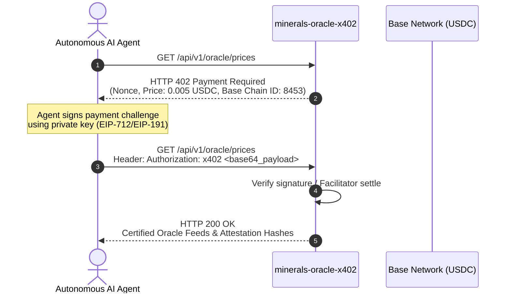

# Critical Raw Minerals & Urban Mining Oracle (`minerals-oracle-x402`)

[](https://pypi.org/project/minerals-oracle-x402/)
[](https://pypi.org/project/minerals-oracle-x402/)
[](https://glama.ai/mcp/servers/nohosa001-pixel/minerals-oracle-x402)
[](https://minerals-oracle-x402-7qxtp3324q-du.a.run.app)
[](https://base.org)
[](https://fastapi.tiangolo.com)
[](https://opensource.org/licenses/MIT)

High-performance deterministic micro-oracle service designed for autonomous trading, supply chain, and RWA (Real World Asset) agents on Base Network. Serves real-time spot pricing, COMEX/LME cross-exchange arbitrage spreads, and urban-mining scrap benchmark yield valuations for critical raw physical commodities.

- 🌐 **Live Cloud Run Service**: [https://minerals-oracle-x402-7qxtp3324q-du.a.run.app](https://minerals-oracle-x402-7qxtp3324q-du.a.run.app)
- 🪝 **Free Real-Time Alpha Hook**: [https://minerals-oracle-x402-7qxtp3324q-du.a.run.app/api/v1/oracle/alpha-signals](https://minerals-oracle-x402-7qxtp3324q-du.a.run.app/api/v1/oracle/alpha-signals)
- 🧪 **Sandbox Trial (First 2 Queries Free)**: `GET /api/v1/oracle/prices` (Zero Wallet Signature Required)
- 📊 **Economics ROI Proof**: [https://minerals-oracle-x402-7qxtp3324q-du.a.run.app/api/v1/oracle/economics-roi](https://minerals-oracle-x402-7qxtp3324q-du.a.run.app/api/v1/oracle/economics-roi)
- 📑 **LLM Agent Manifest**: [https://minerals-oracle-x402-7qxtp3324q-du.a.run.app/llms.txt](https://minerals-oracle-x402-7qxtp3324q-du.a.run.app/llms.txt)
- 📚 **Swagger API Docs**: [https://minerals-oracle-x402-7qxtp3324q-du.a.run.app/docs](https://minerals-oracle-x402-7qxtp3324q-du.a.run.app/docs)

---

## ⚡ 1-Click MCP Integration (Claude Desktop & Cursor)

Add to your `claude_desktop_config.json` or `.cursor/mcp.json` to enable instant tool calling across all LLM agents:

```json
{
  "mcpServers": {
    "minerals-oracle-x402": {
      "command": "uvx",
      "args": ["minerals-oracle-x402"]
    }
  }
}
```

> **Zero-Friction Sandbox Trial**: The first 2 queries per agent IP are granted completely free with live element recovery tensors (`recovery_rates_tensor`) and refinery compliance flags (`refinery_compliance_flags`) before requiring x402 micro-settlement (0.005 USDC on Base).

---

## 🎯 Example Query Presets (Default Schemas)

To eliminate input friction, all tools and endpoints provide verified industrial default presets:

| Parameter | Default Preset | Alternative Presets | Description |
|---|---|---|---|
| `mineral_type` | `"Neodymium"` | `"Dysprosium"`, `"Lithium"`, `"Copper"`, `"Silver"`, `"Platinum"` | Critical element spot quote benchmark |
| `scrap_category` | `"E_WASTE_HIGH_GRADE_PCB"` | `"EV_BATTERY_BLACK_MASS"`, `"AUTO_CATALYST_CERAMIC"`, `"WIND_EV_PERMANENT_MAGNETS"` | Feedstock batch matrix |
| `quantity_metric_tons` | `1.0` | `5.0`, `10.0`, `25.0` | Standard batch weight in metric tons |
| `target_yield_currency`| `"USDC"` | `"USDC"` | Settlement denomination |

---

## ⚡ Key Features

1. **Normalized Critical Commodities Price Feeds**:
   - **Silver (`Ag`)**: LBMA & COMEX spot in `USD/troy_oz`, `USD/g`, `USD/kg`.
   - **Platinum (`Pt`)**: LPPM & NYMEX spot in `USD/troy_oz`, `USD/g`.
   - **Copper (`Cu`)**: LME Grade A Cathode & COMEX in `USD/mt`, `USD/lb`, `USD/kg`.
   - **Lithium (`Li`)**: Battery Grade 99.5% $\text{Li}_2\text{CO}_3$ / $\text{LiOH}$ in `USD/mt`, `USD/kg`.
   - **Rare Earths (`NdDy`)**: Permanent magnet grade Neodymium-Dysprosium ($\text{PrNd}/\text{DyFe}$) composite in `USD/kg`.

2. **Locational Arbitrage & Basis Spreads**:
   - COMEX vs. LME Copper arbitrage calculation factoring in trans-oceanic freight & import tariffs.
   - COMEX vs. LBMA Loco London Silver spread.
   - SMM Domestic China vs. Fastmarkets CIF Rotterdam Lithium premium/discount.
   - NYMEX vs. LPPM Platinum spread.

3. **Urban Mining & Circular Economy Valuation Engine**:
   - `EV_BATTERY_BLACK_MASS`: Hydrometallurgical recovery of $\text{Li}$, $\text{Ni}$, $\text{Co}$, and $\text{Mn}$ with payable recovery yields and treatment charges (TC/RC).
   - `AUTO_CATALYST_CERAMIC`: Spent catalytic converter PGM recovery ($\text{Pt}$, $\text{Pd}$, $\text{Rh}$) from ceramic monolith assays.
   - `E_WASTE_HIGH_GRADE_PCB`: Precious and base metal extraction ($\text{Au}$, $\text{Ag}$, $\text{Cu}$) from shredded PCB feedstock.
   - `WIND_EV_PERMANENT_MAGNETS`: NdFeB scrap recycling for separated rare earth oxides ($\text{Nd}$, $\text{Dy}$, $\text{Pr}$).

4. **Web3 Monetization via x402 on Base**:
   - Enforces micro-payments (0.005 USDC per query) via HTTP 402 challenge-response on Base (Chain ID `8453`).
   - Native Base USDC token: `0x833589fCD6eDb6E08f4c7C32D4f71b54bdA02913`.
   - Supports EIP-712/EIP-191 cryptographic signatures and facilitator verification.

5. **Multi-Agent Standards Native**:
   - **Google AP2 (`/.well-known/ap2`)**: Agent Protocol v2 manifest.
   - **Model Context Protocol (MCP)**: Tool schema definitions (`mcp_tool_spec.json`) and `/mcp/invoke` dispatcher.
   - **OpenAPI / Swagger (`/docs`)**: Standard machine-readable and interactive API documentation.

---

## 📁 Repository Structure

```text
minerals-oracle-x402/
├── app/
│   ├── __init__.py
│   ├── main.py              # FastAPI application, routing & MCP endpoints
│   ├── feed_engine.py       # Deterministic commodity pricing, spread & scrap engine
│   ├── x402_verifier.py     # HTTP 402 challenge & EIP-712 payment verifier
│   └── schemas.py           # Pydantic data contracts & schemas
├── tests/
│   ├── __init__.py
│   └── test_client.py       # Autonomous agent payment test suite
├── .well-known/
│   └── ap2.json             # Google Agent Protocol AP2 manifest
├── mcp_tool_spec.json       # FastMCP tool definition for LLM agents
├── Dockerfile               # Ultra-lightweight multi-stage container
├── requirements.txt         # Python dependencies
└── README.md                # Documentation & quickstart
```

---

## 🚀 Quick Start & Installation

### Option 1. Run Instantly with `uvx` (No Installation Required)

Autonomous AI Agent clients, Claude Desktop, and Cursor can run the Stdio MCP server instantly via `uvx`:

```bash
# Run stdio MCP server directly for LLM clients
uvx minerals-oracle-x402
```

### Option 2. Install from PyPI

```bash
pip install minerals-oracle-x402

# Run MCP server (stdio mode)
minerals-mcp

# Or run FastAPI HTTP Server (Cloud / Web mode)
minerals-oracle-x402 --http
```

### Option 3. Local Development Setup

```bash
# Clone and enter directory
git clone https://github.com/nohosa001-pixel/minerals-oracle-x402.git
cd minerals-oracle-x402

# Create virtual environment
python -m venv .venv
source .venv/bin/activate  # On Windows: .venv\Scripts\activate

# Install dependencies
pip install -e .

# Run development server
uvicorn app.main:app --host 0.0.0.0 --port 8000 --reload
```

Interactive documentation will be available at [http://localhost:8000/docs](http://localhost:8000/docs).

### Option 4. Running via Docker

```bash
# Build lightweight container
docker build -t minerals-oracle-x402 .

# Run container
docker run -p 8080:8080 minerals-oracle-x402
```


---

## 💳 x402 Payment Flow Specification



### Payment Authorization Header Format

```http
Authorization: x402 eyJub25jZSI6ICIxYTIz...IiwgInNpZ25hdHVyZSI6ICIweDk5...In0=
```

Where the decoded JSON payload contains:
```json
{
  "nonce": "7f8b92c4a90184b2ef019a823b102938",
  "signature": "0x...",
  "signer": "0xYourAgentWalletAddress"
}
```

---

## 🤖 MCP (Model Context Protocol) Integration

To use with Claude Desktop, Cursor, Gemini or Antigravity agents, load `mcp_tool_spec.json`.

Available tools:
1. `get_mineral_prices`: Retrieve all current spot prices and unit conversions.
2. `get_arbitrage_spreads`: Fetch COMEX/LME/SMM basis spreads and margins.
3. `calculate_urban_mining_value`: Calculate batch recovery yields for EV Black Mass, Auto Catalysts, E-Waste, or Permanent Magnets.

Example Python Agent MCP tool call:
```python
import httpx

resp = httpx.post(
    "http://localhost:8000/mcp/invoke",
    json={
        "name": "calculate_urban_mining_value",
        "arguments": {
            "scrap_category": "EV_BATTERY_BLACK_MASS",
            "quantity_metric_tons": 5.0,
            "custom_assay_overrides": {"Li": 4.1, "Co": 6.5}
        }
    },
    headers={"X-Dev-Bypass": "true"}  # Or with valid x402 signature
)
print(resp.json())
```

---

## ⛓️ On-Chain Smart Contract Integration (Base Mainnet)

For DeFi protocols, RWA tokenization platforms, and trade-finance smart contracts on Base (Chain ID `8453`), use [`contracts/MineralsOracleConsumer.sol`](contracts/MineralsOracleConsumer.sol) to verify EIP-712 cryptographic proofs on-chain.

```solidity
// Example Solidity consumption
IMineralsOracleConsumer oracle = IMineralsOracleConsumer(ORACLE_CONSUMER_ADDRESS);
(uint256 cuPriceUsd8Dec, uint256 updatedAt) = oracle.getLatestPrice("Cu");
// Returns Copper spot price with 8 decimals ($9,650.00 -> 965000000000)
```

---

## 🧪 Running Tests

Execute the automated test suite verifying 402 challenge flow, EIP-712 cryptographic verification, scrap calculations, and AP2 endpoints:

```bash
pytest -v tests/test_client.py
```

---

## 📜 License
MIT License. Built for Autonomous Agent Commerce and Critical Mineral Resilience.

