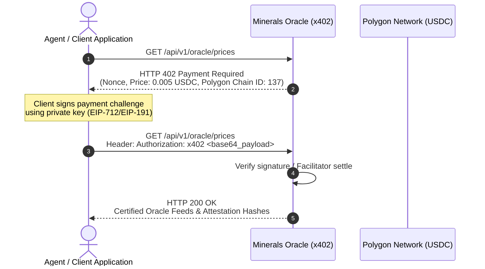

# Critical Raw Minerals & Urban Mining Oracle (`minerals-oracle-x402`)

[](https://pypi.org/project/minerals-oracle-x402/)
[](https://pypi.org/project/minerals-oracle-x402/)
[](https://glama.ai/mcp/servers/nohosa001-pixel/minerals-oracle-x402)
[](https://minerals-oracle-x402-7qxtp3324q-du.a.run.app/dashboard)
[](https://polygon.technology)
[](https://fastapi.tiangolo.com)
[](https://opensource.org/licenses/MIT)

Real-time physical spot market pricing, cross-exchange arbitrage spreads, and metallurgical urban mining scrap recovery yield valuations on Polygon Network.

---

## 🖥️ Interactive Web Dashboard & Simulator (Live)

👉 **[https://minerals-oracle-x402-7qxtp3324q-du.a.run.app/dashboard](https://minerals-oracle-x402-7qxtp3324q-du.a.run.app/dashboard)**

Explore the full consumer and enterprise visual interface directly in your browser:
- 📈 **Real-Time Live Commodity Ticker**: 1.5-second live streaming of COMEX, NYMEX, LME, and SMM market quotes.
- ♻️ **Urban Mining Yield Calculator**: Interactive batch tonnage sliders for EV Battery Black Mass, Auto Catalysts, E-Waste PCBs, and Permanent Magnets.
- 📊 **Dynamic Metallurgical Breakdown**: Instant visual Doughnut chart and element-by-element recovery payouts ($\text{Li}, \text{Ni}, \text{Co}, \text{Cu}, \text{Au}, \text{Ag}, \text{Pt}, \text{Pd}, \text{Rh}, \text{Nd}, \text{Pr}, \text{Dy}$).
- 📡 **Cross-Exchange Arbitrage Radar**: Real-time monitoring of profitable basis spreads between New York, London, and Asian venues.
- 🧪 **Interactive API Playground**: Test all oracle endpoints directly with zero setup.

---

## 🌐 Live Service Links & Resources

| Service / Endpoint | Description | URL Link |
|---|---|---|
| 🖥️ **Web Dashboard** | Interactive visual UI, scrap yield calculator & charts | [Launch Dashboard](https://minerals-oracle-x402-7qxtp3324q-du.a.run.app/dashboard) |
| 🧪 **API Playground** | Browser-based interactive query sandbox | [Open Playground](https://minerals-oracle-x402-7qxtp3324q-du.a.run.app/playground) |
| 🪝 **Live Market Signals** | Free public cross-exchange arbitrage feed | [`/api/v1/oracle/alpha-signals`](https://minerals-oracle-x402-7qxtp3324q-du.a.run.app/api/v1/oracle/alpha-signals) |
| 📚 **Swagger API Docs** | Full interactive OpenAPI documentation | [View Swagger Docs](https://minerals-oracle-x402-7qxtp3324q-du.a.run.app/docs) |
| 📑 **LLM Agent Manifest** | Machine-readable tool specifications | [`/llms.txt`](https://minerals-oracle-x402-7qxtp3324q-du.a.run.app/llms.txt) |

---

## ⚡ 1-Click MCP Integration (Claude Desktop & Cursor)

Connect to Claude Desktop, Cursor, Gemini, or any Model Context Protocol client instantly:

```json
{
  "mcpServers": {
    "minerals-oracle-x402": {
      "command": "uvx",
      "args": ["minerals-oracle-x402"]
    }
  }
}
```

---

## 📦 Core Services & Capabilities

### 1. Real-Time Critical Commodities Price Feeds
Direct live market quotes and normalized multi-unit conversions:
- **Silver (`Ag`)**: COMEX & LBMA spot in `USD/troy_oz`, `USD/g`, `USD/kg`.
- **Platinum (`Pt`)**: NYMEX & LPPM spot in `USD/troy_oz`, `USD/g`.
- **Copper (`Cu`)**: COMEX High Grade & LME Grade A Cathode in `USD/mt`, `USD/lb`, `USD/kg`.
- **Lithium Carbonate (`Li`)**: SMM & Fastmarkets 99.5% Battery Grade in `USD/mt`, `USD/kg`.
- **Rare Earth Magnets (`NdDy`)**: Asian Metal PrNd/DyFe composite in `USD/kg`, `USD/mt`.

### 2. Urban Mining & Circular Economy Valuation Engine
Industrial metallurgy assay benchmarks and commercial smelter treatment/refining charges (TC/RC):
- **`EV_BATTERY_BLACK_MASS`**: Hydrometallurgical extraction of $\text{Li}$, $\text{Ni}$, $\text{Co}$, and $\text{Cu}$ with recovery rates (88.5% ~ 98.0%) and $1,850/MT TC/RC.
- **`AUTO_CATALYST_CERAMIC`**: Spent catalytic converter PGM recovery ($\text{Pt}$, $\text{Pd}$, $\text{Rh}$) with plasma smelting charges ($3,200/MT).
- **`E_WASTE_HIGH_GRADE_PCB`**: Precious and base metal recovery ($\text{Au}$, $\text{Ag}$, $\text{Cu}$, $\text{Pd}$) from high-grade circuit boards with $1,250/MT refining fees.
- **`WIND_EV_PERMANENT_MAGNETS`**: NdFeB permanent magnet scrap recycling for separated oxides ($\text{Nd}$, $\text{Pr}$, $\text{Dy}$) with $2,400/MT separation fees.

### 3. Cross-Exchange Locational Arbitrage Radar
Live spread tracking across major trading hubs:
- **Copper**: COMEX (New York) vs. LME (London Warehouse) with freight and import tariffs.
- **Silver**: COMEX Spot (NY Vault) vs. LBMA (Loco London).
- **Lithium**: SMM (China Domestic) vs. Fastmarkets (CIF Rotterdam).
- **Platinum**: NYMEX Spot (NY) vs. LPPM (London).

---

## 🚀 Quick Start & Installation

### Option 1. Run Instantly with `uvx` (No Installation Required)

```bash
# Run stdio MCP server directly for LLM clients
uvx minerals-oracle-x402
```

### Option 2. Install from PyPI

```bash
pip install minerals-oracle-x402

# Run MCP server (stdio mode)
minerals-mcp

# Or run FastAPI HTTP Server (Cloud / Web mode)
minerals-oracle-x402 --http
```

### Option 3. Local Development Setup

```bash
# Clone repository
git clone https://github.com/nohosa001-pixel/minerals-oracle-x402.git
cd minerals-oracle-x402

# Create virtual environment
python -m venv .venv
source .venv/bin/activate  # On Windows: .venv\Scripts\activate

# Install dependencies
pip install -e .

# Run development server
uvicorn app.main:app --host 0.0.0.0 --port 8000 --reload
```

Open [http://localhost:8000/dashboard](http://localhost:8000/dashboard) to view the live dashboard locally.

---

## 💳 x402 Web3 Settlement on Polygon Network

The oracle supports automated on-chain micro-settlements (0.005 USDC per query) via HTTP 402 challenge-response on Polygon (Chain ID `137`):
- **Polygon USDC Token**: `0x3c499c542cEF5E3811e1192ce70d8cC03d5c3359`
- **Treasury Recipient**: `0x255F9991233f86B29dB847c8d5b8CB9915e80dCf`
- **Authentication**: Supports EIP-712/EIP-191 signatures and standard `Authorization: x402 <payload>` headers.



---

## 🧪 Running Automated Tests

Run the full test suite verifying price feeds, urban mining calculations, 402 challenge flows, and web dashboard endpoints:

```bash
pytest -v
```

---

## 📜 License
MIT License. Built for Transparent Commodity Pricing, Circular Economy Recycling, and Web3 Infrastructure.
