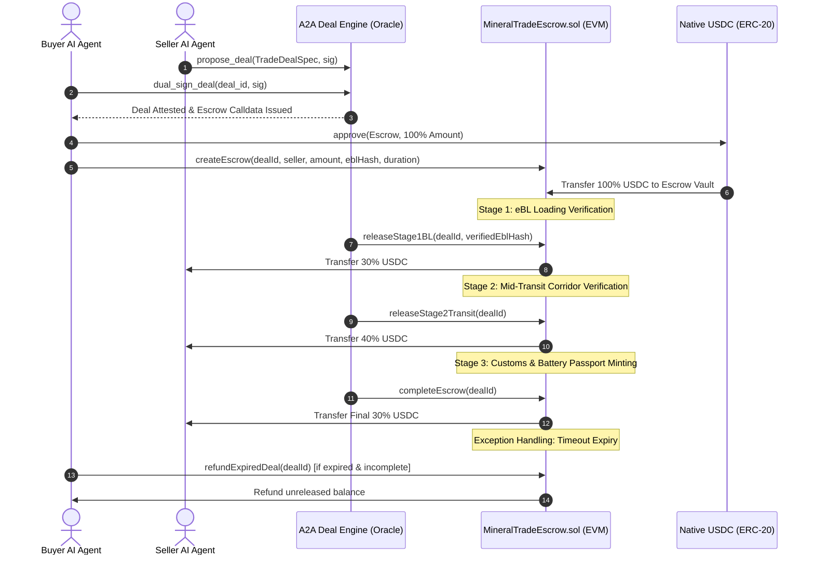

# ERC-MilestoneTradeEscrow Standard Specification

## 1. Abstract
The **Autonomous Multi-Milestone Escrow Standard for Physical Commodities & Battery Minerals (`MineralTradeEscrow`)** defines a standardized smart contract architecture and agent-to-agent (A2A) interface for settling high-value physical commodity trades.

By transitioning from legacy, paper-based Letters of Credit (L/C)—which incur 1.5–3.0% financial overhead and multi-week processing delays—to an autonomous, oracle-attested smart contract, trades are settled transparently, instantaneously, and cryptographically.

---

## 2. Motivation & Industry Background
Global trade in critical minerals (Lithium, Nickel, Cobalt, Rare Earth Elements, Copper) requires phased payment matching the physical supply chain risks:
1. **At Mine / Port of Loading**: Seller incurs significant extraction, logistics, and loading costs; requires proof of title transfer via Electronic Bill of Lading (eBL).
2. **In Mid-Transit Corridor**: Maritime shipment traverses high-seas corridors; requires independent geospatial tracking (AIS satellite pings).
3. **At Port of Discharge**: Buyer receives cargo; requires customs clearance, lab assay certificates, and EU Battery Passport / FEOC compliance validation before releasing final retention funds.

Vanilla single-tranche escrow contracts expose either the buyer or the seller to complete counterparty default. `MineralTradeEscrow` enforces a deterministic **30% - 40% - 30%** milestone payment schedule governed by multi-oracle attestations.

---

## 3. Protocol Architecture



---

## 4. Contract Specifications (`MineralTradeEscrow.sol`)

### 4.1 State Machine
```
[CREATED] 
    │
    ▼ (releaseStage1BL: 30% release upon verified eBL hash match)
[STAGE_1_BL_RELEASED]
    │
    ▼ (releaseStage2Transit: 40% release upon AIS transit corridor ping)
[STAGE_2_TRANSIT_RELEASED]
    │
    ▼ (completeEscrow: 30% release upon customs clearance & battery passport)
[COMPLETED]

Alternative Path:
[ANY STAGE < COMPLETED] ── (block.timestamp > deadlineTimestamp) ──► [REFUNDED]
```

### 4.2 Security Guards
1. **Anti-Instant-Expiry Guard**: `durationSeconds >= 60` strictly checked at creation to prevent front-running refund exploits.
2. **Hash-Binding Authenticity**: Stage 1 requires exact matching of the on-chain hashed electronic Bill of Lading (`deal.eblHash == verifiedEblHash`).
3. **Privilege Segregation**:
   - `onlyOracle`: Restricted to `trustedOracleSigner` and contract owner for milestone releases.
   - `refundExpiredDeal`: Restricted strictly to `buyerAgent` or contract owner, only after `block.timestamp > deadlineTimestamp`.
4. **Reentrancy & Balance Invariance**: State transitions and released counters are updated prior to ERC-20 transfer calls (`Checks-Effects-Interactions` pattern).

---

## 5. Agent-to-Agent (A2A) Integration API

### 5.1 Calldata Generation Endpoint
- **HTTP Method**: `GET /api/v1/a2a/deals/{deal_id}/escrow-calldata`
- **Output Schema**:
```json
{
  "deal_id": "DEAL-2026-LIT-001",
  "escrow_contract_address": "0xb44Bc2Acdd156cE08b549A00a3102e4B01276654",
  "required_usdc_amount": 700000.0,
  "required_usdc_units": 700000000000,
  "seller_agent_address": "0x1111111111111111111111111111111111111111",
  "buyer_agent_address": "0x2222222222222222222222222222222222222222",
  "deal_id_bytes32": "0x8fae...31a",
  "ebl_hash_bytes32": "0x4b7c...29e",
  "duration_seconds": 1209600,
  "function_signature": "createEscrow(bytes32,address,uint256,bytes32,uint256)",
  "calldata": "0x8670ff13...",
  "next_action": "Buyer agent must approve USDC allowance to escrow_contract_address, then broadcast calldata to target contract."
}
```

---

## 6. Multi-Chain Deployment Matrix
| Network | Chain ID | USDC Token Address | Minerals Oracle Consumer | Mineral Trade Escrow | Status |
| :--- | :--- | :--- | :--- | :--- | :--- |
| **Polygon Mainnet** | 137 | `0x3c499c542cEF5E3811e1192ce70d8cC03d5c3359` | `0x835d01534a5D2e63D52636Fafb1019f889d1E66B` | Ready for Broadcast | **Target Active** |
| **Polygon Amoy** | 80002 | `0x41E94Eb019C0762f9Bfcf9Fb1E58725BfB0e7582` | Testnet Oracle | Testnet Escrow | **Supported** |
| **Base Sepolia** | 84532 | `0x036CbD53842c5426634e7929541eC2318f3dCF7e` | Testnet Oracle | Testnet Escrow | **Supported** |

---

## 7. Compliance Compatibility
- **US IRA § 30D**: Foreign Entity of Concern (FEOC) certification verification before contract finalization.
- **EU CBAM & Battery Regulation**: Carbon Border Adjustment liability calculation integrated with EU ETS carbon spot oracle feeds ($78.50/tCO2e benchmark).
- **UN/CEFACT & DCSA**: Electronic Bill of Lading standards alignment.
